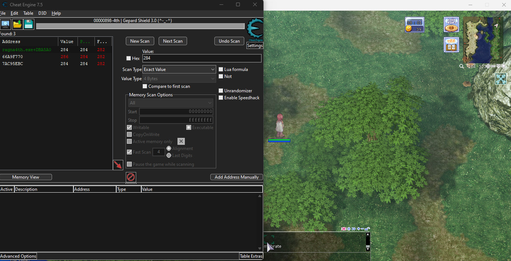
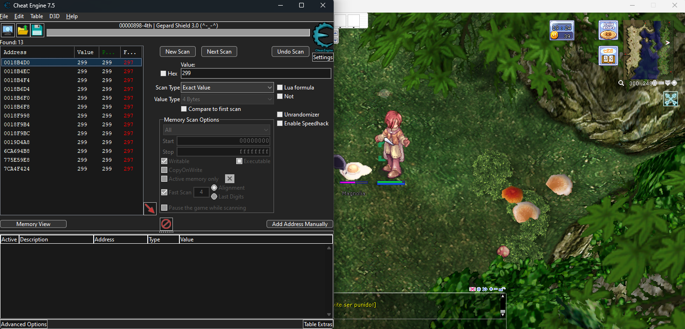
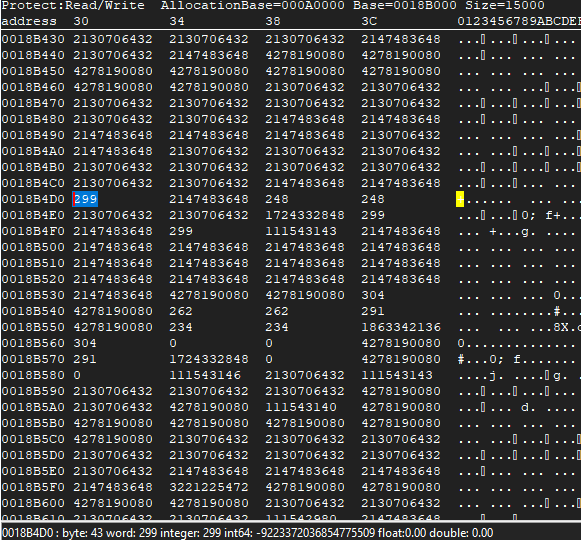
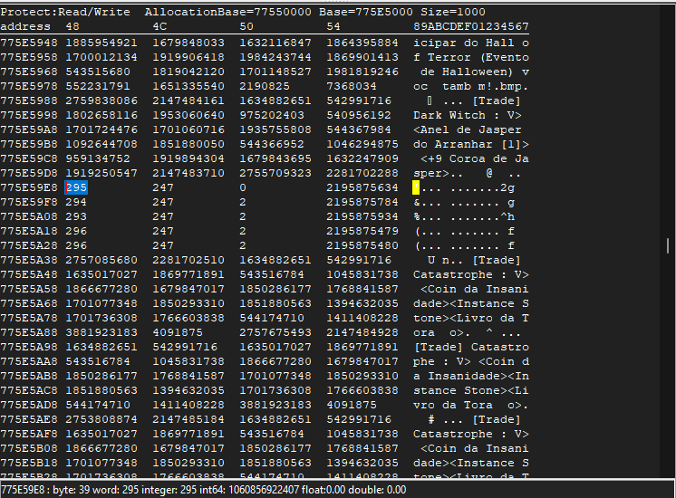
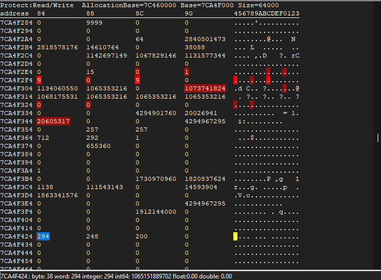
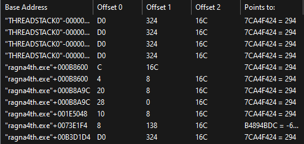
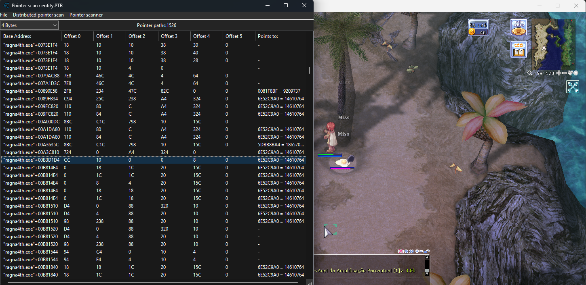
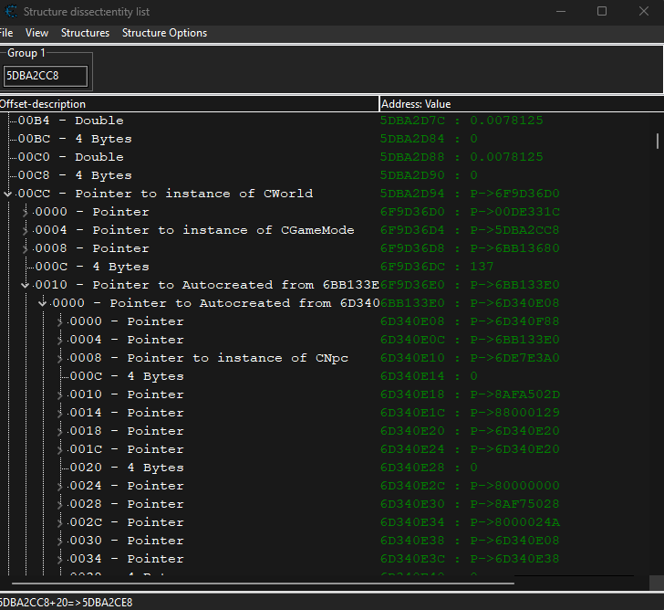

# Bot for Ragnarok Online

## About

Developed for [Ragna4th](https://www.ragna4th.com/) private server.

The purpose of this project is to learn reverse engineering and Windows API in Python. It's an external software that reads the game memory and sends inputs.

## Features

- **Macro:** hardcoded macro that supports sending keystrokes and mouse clicks directly to the game window. The mouse click can't be sent to a specific location if the window is not on top, but the click is registered. Useful for spamming a skill on you character feet while alt-tabbing. It runs in a separate thread because of the delays on it and can be toggled on/off.
- **Game information:** reads game information that is needed for executing actions, such as the character name, current map name, map coordinates, current hp, maximum hp.
- (In progress) **Walking:** the game stores some map information the .gat files. These files were extracted from the game and read, creating a graph with whether each map cell is walkable of not. Most of the maps can be up to 400x400, but this information is also present in the .gat file.
- **Entity list:** reads the current entities (players, npcs, monsters...) in the screen. Will be used in the future for fighting monsters.

## Compiling the c++ file to dll
The c++ file can be compiled with any c++ compiler, as long as the target platform is 64bit Windows.

Using [MSVC](https://learn.microsoft.com/en-us/cpp/build/reference/compiler-options?view=msvc-170), it can be compiled with:
`cl.exe /LD /EHsc helpers/shortest_path.cpp`

Put the dll in the _helpers_ folder. You can check if the function is being exported correctly with `dumpbin /exports helpers/shortest_path.dll`. The output must export `My_ShortestPath`.

## Documentation

This section will contain the documentation of the process of reverse engineering the game.The whole reverse engineering was made using [Cheat Engine](https://www.cheatengine.org/) 7.5 (CE) (32-bit version, because Ragnarok Online is 32-bit). No debugger could be attached to the game process because of [Gepard Shield](https://rathena.org/board/thirdpartyservices/gepard-shield-30-r41/), and CE's DBVM debugger only caused BSOD when it was loaded, probably because I am on an AMD CPU.

### Local Player

Local players offsets were found by searching their values on CE. The first values were the player name, current map name, coordintes, current HP and maximum HP. It was pretty straightforward. Below is an example of the static offset found for the player's x coordinate.

In this case, the first one was the actual player coordinate. The middle one changed and did not match the correct value after a few seconds, so it was discarded. The last one was was not the actual player coordinate, but the coordinate that the player was moving to. Using it resulted in problems when moving the character, because it did not represent the character location in real time. The difference between the first and the last address could be seend by moving the character. The first value was continously changing while the character we moving, while the last one change once when a new location was clicked.

### World

The world is a struct that holds all basic information for the game to work, such as pointers to the local player and pointer to the entity list. It was found while pointer scanning the entity list.

### Entity

To find an entity address, I started by attacking them (so they followed my character) and then searched for their x coordinate in CE. I moved and searched for the new coordinate until I had only a few addressess.



The addresses in the 0x18XXX range did not seem to be part of an entity struct. All of them were just x coordinate + something + y coordinate surrounded by values that did not seem to be part of an entity.



However, the last two last but ones also did not look the right ones, they were only the x and y coordinates surrounded by a lot of text that looked like the chat messages in the screen.



The last one was the right one. The values around the x coordinate changed accordingly to the monster's attacks and I could see the value 1138 a few bytes above the coordinates, which is the monster id according to the [game database](https://ratemyserver.net/index.php?mob_name=1138&page=re_mob_db&quick=1&f=1&mob_search=Search).



After pointer scanning this address, I could see that the offset to the x coordinate was 0x16C after some trial and error. With that, I could find the base address of the monsters by searching for the x coordinate and subtracting 0x16C.



### Entity List

After lots of hours, the entity list was found. It is a double linked list with pointers to every entity in the screen. Entities can be players, monsters, npcs, portals or pets (they can probably be more things).

To find the entity list, I started by finding the base address of some monsters in my screen. Then, I pointer scanned them and compared the results. After a lot of trial and error I found that [0xB3D1D4 + 0xCC] + 0x10 was the right one. The entity list could be defined as:

```
struct EntityList {      // Offset
   EntityList* next;     // 0
   EntityList* prev;     // 4
   Entity* entity;       // 8
};
```

Each pointer pointed to a struct that is not completely known yet, but the offset 0x8 is always a pointer to what we called Entity in this project. Other attributes from this struct seem to hold sprite information and pointer to monster HP struct.




### Map

The _.gat_ files were extacted from the game's _data.grf_ using [this GRF editor](https://rathena.org/board/files/file/2766-grf-editor/). Then, [this article from Openkore wiki](https://openkore.com/wiki/Field_file_format) explained how to parse the file. After skipping the header (6 bytes), the width and height of the map were extracted from the next 8 bytes. Then, the rest of the file was read in blocks of 20 bytes, the data was unpacked using the _struct_ library.


### TODO

[] Walk to a coordinate outside of screen area. Basically use the [A*](https://www.geeksforgeeks.org/a-search-algorithm/) algorithm to find the shortest path in the map graph read from the _.gat_ files. Will probably be implemented both in Python and C (using [Cython](https://cython.org/)) for performance comparison.

[] Pick up items from the ground.

[] Walking from anywhere to anywhere. Will probably look into Openkore files to find where the information about map links are (which maps connect to which maps).

[] Automatic storing/selling items.
